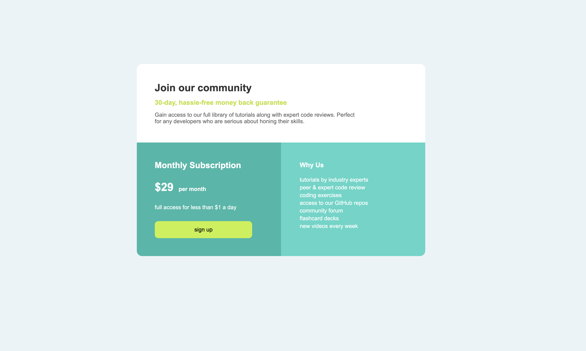

# Description

Ce projet consiste à réaliser une carte de tarification moderne et responsive en HTML et CSS.
 L'objectif est de présenter une offre d'abonnement claire, avec une section principale pour le prix et une section secondaire expliquant les avantages du service.
---

## Fonctionnalités

- Design centré sur la page
- Responsive (ordinateur, tablette et mobile)
- Boutons interactifs avec effet hover
- Structure HTML sémantique et code CSS organisé

## Technologies utilisées

- HTML5
- CSS3
## Responsivité

- Ordinateur : 2 colonnes côte à côte
- Tablette et Mobile : colonnes empilées verticalement
- Textes centrés et boutons adaptés aux petits écrans

## Structure du projet

### Single-Price-Grid
- index.html
- style.css 
- README.md 

